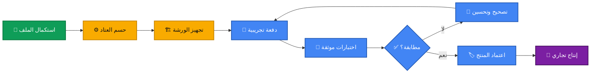
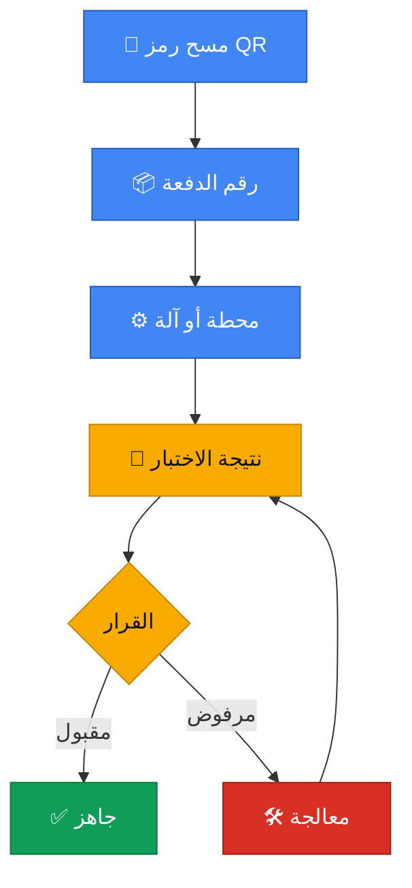

<div align="center">


### 💡 مشروع جزائري لحلول الإضاءة بتقنية LED
### Projet algérien de solutions d’éclairage LED

🟠 `PRE-LAUNCH`　🔵 `DOSSIER TECHNIQUE`　⚪ `PRODUCTION NON DÉMARRÉE`

<br/>

[**📊 حالة المشروع**](#project-status) •
[**🗺️ مسار الإطلاق**](#roadmap) •
[**🧪 الجودة**](#quality) •
[**💡 المنتجات**](#products) •
[**🛠️ الأدوات**](#tools) •
[**📞 التواصل**](#contact)

</div>

---

<a id="project-status"></a>

## 🎛️ حالة المشروع • État du projet

> [!IMPORTANT]
> **Jannah Light مشروع في مرحلة ما قبل الإطلاق، ولم يبدأ الإنتاج التجاري بعد.**  
> القيم المعروضة أدناه هي بيانات مرجعية أو أهداف تخطيطية، وليست نتائج إنتاج أو شهادات متحصلاً عليها.

<table>
<tr>
<td width="25%" align="center">

### 💰
**الاستثمار المرجعي**
#### `8,956,392 DZD`

</td>
<td width="25%" align="center">

### 🏭
**الطاقة المخططة**
#### `59,500 / 60,000`
<sub>قيد الحسم</sub>

</td>
<td width="25%" align="center">

### 📐
**الورشة المخططة**
#### `200 m²`

</td>
<td width="25%" align="center">

### 👥
**الفريق المرجعي**
#### `8 أشخاص`

</td>
</tr>
</table>

<details>
<summary><b>🔎 اضغط هنا لفهم رموز الحالة</b></summary>
<br/>

| الرمز | الحالة | المعنى |
|:---:|:---|:---|
| 🟢 | **محدد** | مثبت في الملف الحالي |
| 🔵 | **مستهدف** | هدف يحتاج إلى اختبار |
| 🟠 | **قيد القرار** | لم يُحسم نهائياً |
| ⚪ | **لم يبدأ** | لا توجد نتائج فعلية بعد |
| 🔴 | **غير معتمد** | لا يجوز نشره كإنجاز |

</details>

---

## 💫 الرؤية • Notre vision

<div align="center">

### **«نصنع الجودة لنضيء المستقبل بعقول جزائرية»** 🇩🇿

**Qualité mesurée • Traçabilité • Amélioration continue**

</div>

يركز المشروع على بناء إنتاج محلي منظم وقابل للتتبع والتحسين المستمر، مع اعتماد المواصفات التقنية ونتائج الاختبارات الفعلية بدلاً من الادعاءات غير الموثقة.

---

## 📊 لوحة التحكم • Tableau de bord

| المحور | الوضع | التفاصيل |
|:---|:---:|:---|
| 💰 الاستثمار | 🟢 محدد | 8,956,392 DZD |
| 🏭 الطاقة السنوية | 🟠 قيد القرار | 59,500 أو 60,000 |
| 💡 منتجات السنة الأولى | 🟠 قيد القرار | قبل الإطلاق |
| 🛡️ مدة الضمان | 🟠 قيد القرار | بعد الاختبارات |
| 🧪 المطابقة التقنية | 🔵 مستهدفة | دون شهادة حالياً |
| 🚀 الإنتاج التجاري | ⚪ لم يبدأ | مرحلة التحضير |

<details>
<summary><b>📌 لماذا لا نعرض أرقام الأداء القديمة؟</b></summary>
<br/>

القيم مثل **50,000 ساعة** و**99% جودة** و**−80% استهلاك** لا تُعرض كحقائق قبل وجود قياسات وتقارير داعمة. ويمكن نشرها لاحقاً بوصفها نتائج فعلية عندما يكتمل الاختبار والتوثيق.

</details>

---
<a id="roadmap"></a>

## 🗺️ مسار الإطلاق • Feuille de route



### 🧭 مؤشرات التقدم

- [x] إعداد المرجع التشغيلي الأولي للمشروع
- [ ] حسم القائمة النهائية للآلات والموردين
- [ ] تثبيت منتجات السنة الأولى
- [ ] تجهيز الورشة وتركيب المعدات
- [ ] إنتاج دفعة تجريبية قابلة للتتبع
- [ ] توثيق اختبارات السلامة والأداء
- [ ] اعتماد مدة الضمان بناءً على النتائج
- [ ] بدء الإنتاج التجاري

<details>
<summary><b>🧱 المرحلة الحالية: ماذا يجري الآن؟</b></summary>
<br/>

العمل الحالي يتركز على **الملف التقني، قائمة المعدات، الموردين، تمويل المشروع، وتثبيت القرارات المؤجلة**. الانتقال إلى مؤشرات الأداء الفعلية يبدأ فقط بعد تجهيز الورشة وإنتاج الدفعة التجريبية.

</details>

---

<a id="quality"></a>

## 🧪 منظومة الجودة المخططة • Système qualité

<table>
<tr>
<td width="33%" align="center" valign="top">

### 📦 01
**الاستلام**

فحص المكونات والوثائق  
مطابقة الكميات  
تسجيل الدفعات

</td>
<td width="33%" align="center" valign="top">

### ⚙️ 02
**التجميع**

تعليمات عمل موحدة  
ضبط العملية  
تتبع كل دفعة

</td>
<td width="33%" align="center" valign="top">

### ✅ 03
**التحقق**

اختبارات كهربائية  
قياسات حرارية وضوئية  
قرار قبول أو رفض

</td>
</tr>
</table>

<details open>
<summary><b>⚡ الاختبارات المخطط توثيقها</b></summary>
<br/>

- 👁️ **الفحص البصري:** جودة التجميع وسلامة المكونات.
- 🧲 **Megohmmeter:** قياس مقاومة العزل الكهربائي.
- ⚡ **Hi-Pot:** اختبار تحمل الجهد الكهربائي.
- 🌡️ **الاختبار الحراري:** مراقبة درجات الحرارة أثناء التشغيل.
- 📈 **القياسات الكهربائية:** الاستطاعة ومعامل القدرة.
- 💫 **الوميض:** التحقق من القيمة المستهدفة **SVM ≤ 0.4**.
- 🔢 **التتبع:** رقم الدفعة والنتيجة وقرار القبول أو الرفض.

</details>

<details>
<summary><b>📚 المراجع التقنية المستهدفة</b></summary>
<br/>

> [!NOTE]
> إدراج المعيار يعني أنه **مرجع للتصميم والاختبار**، ولا يعني الحصول حالياً على شهادة مطابقة.

| المرجع | الاستخدام | الحالة |
|:---|:---|:---:|
| IEC 62560 | سلامة مصابيح LED | 🔵 مستهدف |
| IEC 62612 | أداء مصابيح LED | 🔵 مستهدف |
| LM-80 / TM-21 | تقدير العمر | 🟠 يتطلب بيانات |
| RoHS | المواد الخطرة | 🔵 مستهدف |
| ISO 9001 | إدارة الجودة | ⚪ هدف مستقبلي |

</details>

---
## 🚦 لوحة التحقق • Validation board

<table>
<tr>
<td align="center" width="33%">

### 💡 العمر التشغيلي
#### 🟠 `À VALIDER`
<sub>بيانات LM-80 وتقدير TM-21</sub>

</td>
<td align="center" width="33%">

### ⚡ الكفاءة الطاقوية
#### 🟠 `À MESURER`
<sub>مقارنة بخط أساس محدد</sub>

</td>
<td align="center" width="33%">

### ✅ نسبة الجودة
#### ⚪ `EN ATTENTE`
<sub>نتائج دفعات إنتاج فعلية</sub>

</td>
</tr>
</table>

| المؤشر | شرط الانتقال إلى 🟢 |
|:---|:---|
| العمر التشغيلي | بيانات اختبار موثقة |
| التوفير الطاقوي | قياس ومقارنة محددة |
| نسبة الجودة | نتائج إنتاج فعلية |
| الكفاءة الكهربائية | تقرير قياسات |
| مدة الضمان | قرار بعد الاعتمادية |
| الشهادات | وثيقة من جهة مؤهلة |

---

<a id="products"></a>

## 💡 المنتجات • Gamme en étude

> [!WARNING]
> التشكيلة التالية **تصورات قيد الدراسة وليست قائمة إطلاق نهائية**. تعتمد البطاقات التجارية فقط بعد تثبيت النماذج وإجراء الاختبارات.

<table>
<tr>
<td align="center" width="25%">

### 🟢 ECO
#### `5W`
**Ampoule Eco**  
E27  
<sub>تصور أولي</sub>

</td>
<td align="center" width="25%">

### 🔵 ZENER
#### `9W`
**Zener Protect**  
حماية إضافية  
<sub>تصور أولي</sub>

</td>
<td align="center" width="25%">

### 🟠 PRO
#### `12W`
**Ampoule Pro**  
فئة محسّنة  
<sub>تصور أولي</sub>

</td>
<td align="center" width="25%">

### 🔴 ATELIER
#### `18W`
**Éclairage Atelier**  
استخدام مهني  
<sub>تصور أولي</sub>

</td>
</tr>
</table>

<details>
<summary><b>🧾 افتح نموذج بطاقة المنتج المستقبلية</b></summary>
<br/>

```text
اسم المنتج       : بعد الاعتماد
الاستطاعة         : نتيجة القياس
الجهد والتردد     : حسب النموذج النهائي
التدفق الضوئي     : نتيجة القياس
معامل القدرة      : نتيجة القياس
SVM               : نتيجة القياس
العمر المعلن      : مدعوم ببيانات الاختبار
الضمان            : حسب القرار النهائي
رقم الدفعة        : كود التتبع
حالة المنتج       : تجريبي / معتمد
```

</details>

<details>
<summary><b>✅ شروط اعتماد أي منتج</b></summary>
<br/>

1. تثبيت الاستطاعة والجهد والتردد.
2. قياس التدفق الضوئي ودرجة حرارة اللون.
3. التحقق من معامل القدرة والوميض.
4. تسجيل درجات الحرارة أثناء التشغيل.
5. اجتياز اختبارات السلامة المحددة.
6. اعتماد الضمان ونظام تتبع الدفعات.

</details>

---
<a id="tools"></a>

## 🛠️ الأدوات التشغيلية • Outils opérationnels

<div align="center">

`QR TRACKING`　`GOOGLE SHEETS`　`PYTHON`　`GITHUB`　`KAIZEN`

</div>

| الأداة | الاستخدام الحقيقي |
|:---|:---|
| 🔳 QR / Batch | ربط المنتج بالدفعة |
| 📊 Google Sheets | الإنتاج والمخزون |
| 🐍 Python | حسابات وسكربتات داخلية |
| 🐙 GitHub | إدارة النسخ البرمجية |
| 🔁 Kaizen | التحسين والإجراءات |

<details>
<summary><b>🤖 تصور التتبع الرقمي</b></summary>
<br/>



</details>

---

## 🏅 الإنجازات الحقيقية • Jalons réalisés

<table>
<tr>
<td align="center" width="25%">📘<br/><b>مرجع تشغيلي</b><br/><sub>قيد التطوير</sub></td>
<td align="center" width="25%">🧮<br/><b>بيانات مالية</b><br/><sub>مرجع محدد</sub></td>
<td align="center" width="25%">🧪<br/><b>خطة جودة</b><br/><sub>مخططة</sub></td>
<td align="center" width="25%">🇩🇿<br/><b>إنتاج محلي</b><br/><sub>هدف المشروع</sub></td>
</tr>
</table>

> **الإنجاز هنا يعني عملاً تم فعلاً في مرحلة التحضير، ولا يعني أن المصنع بدأ الإنتاج أو أن المنتج حصل على شهادات.**

---

## 🧭 ميثاق الشفافية • Charte de transparence

<div align="center">

| 🟢 ننشر | 🔴 لا ننشر قبل الإثبات |
|:---|:---|
| مرحلة المشروع الحقيقية | شهادة غير متحصل عليها |
| الأهداف بصفتها أهدافاً | اختبار لم يُجرَ |
| القيم المرجعية الموثقة | نسبة جودة تقديرية |
| القرارات المؤجلة بوضوح | ضمان غير معتمد |

</div>

<details>
<summary><b>🔐 قاعدة النشر الأساسية</b></summary>
<br/>

### **كل رقم يُقاس، وكل نتيجة تُوثق، وكل ادعاء يستند إلى دليل.**

عندما تتحول قيمة من **مستهدفة** إلى **محققة**، تُضاف معها وثيقة القياس أو الاختبار التي تدعمها.

</details>

---
<a id="contact"></a>

## 📞 التواصل • Contact

<div align="center">

[](mailto:contact.jannahlight@gmail.com)
[](https://github.com/contactjannahlight-web)


<br/>

### 💫 **Notre vision • رؤيتنا**

> ### **«نصنع الجودة لنضيء المستقبل بعقول جزائرية»** 🇩🇿

<sub>Projet en phase de préparation • مشروع في مرحلة التحضير</sub>

</div>

---

<div align="center">

**⭐ إذا أعجبك المشروع، تابع مراحل تطوره عبر GitHub**


</div>
